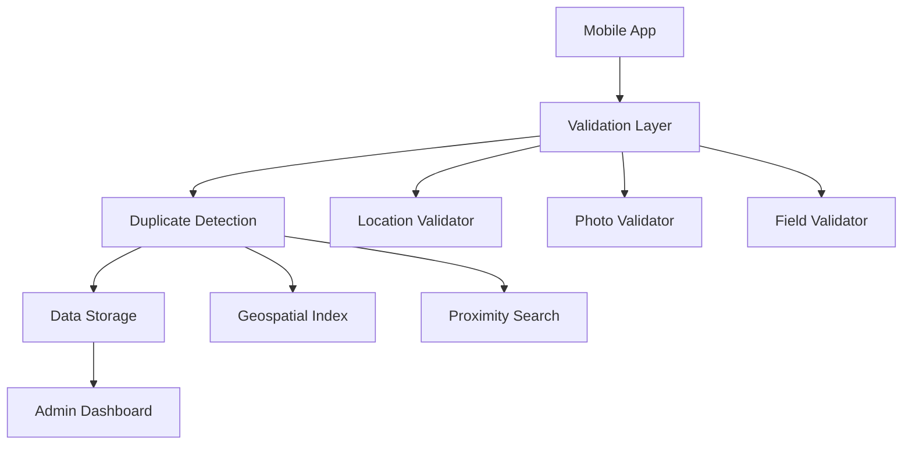

# Design Document

## Overview

RoadWatch implements a validation-driven architecture that prioritizes data quality over volume through multi-layered validation at every submission stage. The system uses a smartphone-first approach with backend validation to ensure accurate, non-duplicate, location-verified road issue reporting.

## Architecture

### High-Level Architecture



### Validation Pipeline

The system implements a strict validation pipeline that processes every submission:

1. **Client-Side Pre-validation**: Initial checks for mandatory fields and basic format validation
2. **Location Validation**: GPS accuracy verification and coordinate validation
3. **Photo Validation**: File format, size, and metadata extraction
4. **Duplicate Detection**: Geospatial proximity search with category matching
5. **Quality Scoring**: Composite validation score calculation
6. **Storage Decision**: Auto-approve (≥70 score) or flag for manual review

## Components and Interfaces

### LocationValidator
Handles GPS accuracy validation and coordinate verification:
- Enforces ≤200m accuracy requirement
- Implements retry logic for poor GPS signals
- Validates coordinate bounds and freshness
- Supports enhanced location with multiple readings

### DuplicateDetector
Implements intelligent duplicate prevention:
- 50-meter proximity threshold with geospatial indexing
- 24-hour time window for same-category issues
- Haversine distance calculation for accuracy
- Configurable thresholds per issue category

### PhotoValidator
Manages image validation and processing:
- Supports JPEG, PNG, WebP formats
- 5MB file size limit enforcement
- Metadata extraction for GPS cross-validation
- Image compression for storage optimization

### ReportValidator
Orchestrates overall validation workflow:
- Combines all validation results
- Calculates weighted quality scores
- Implements validation thresholds
- Provides detailed error reporting

## Data Models

### IssueReport
```typescript
interface IssueReport {
  id: string;
  title: string;
  description: string;
  category: IssueCategory;
  location: Location;
  photos: string[];
  status: IssueStatus;
  priority: IssuePriority;
  reportedAt: Date;
  reportedBy: string;
  validationScore: number;
  duplicateOf?: string;
}
```

### Location
```typescript
interface Location {
  latitude: number;
  longitude: number;
  accuracy: number;
  timestamp: number;
}
```

### ValidationResult
```typescript
interface ValidationResult {
  isValid: boolean;
  score: number;
  reasons: string[];
  duplicateId?: string;
}
```

## Error Handling

### Validation Failures
- **GPS Accuracy Issues**: Retry mechanism with user notification
- **Duplicate Detection**: Show existing report with confirmation options
- **Photo Validation**: Clear error messages with format requirements
- **Field Validation**: Real-time feedback with specific missing fields

### System Resilience
- Graceful degradation for poor network conditions
- Offline capability with sync when connection restored
- Rate limiting to prevent spam submissions
- Comprehensive error logging for debugging

## Correctness Properties

*A property is a characteristic or behavior that should hold true across all valid executions of a system-essentially, a formal statement about what the system should do. Properties serve as the bridge between human-readable specifications and machine-verifiable correctness guarantees.*

### Property 1: File Format Validation
*For any* uploaded file, the system should accept only JPEG, PNG, or WebP formats and reject all other file types
**Validates: Requirements 1.1**

### Property 2: File Size Enforcement
*For any* uploaded image, files exceeding 5MB should be rejected while files 5MB or smaller should be accepted
**Validates: Requirements 1.2**

### Property 3: Location Accuracy Validation
*For any* GPS reading, locations with accuracy better than 200 meters should pass validation while locations with worse accuracy should fail
**Validates: Requirements 2.2**

### Property 4: Stale Location Rejection
*For any* location data, coordinates older than 30 seconds should be rejected while fresh coordinates should be accepted
**Validates: Requirements 2.5**

### Property 5: Best Location Selection
*For any* array of location readings, the system should always select the reading with the highest accuracy (lowest accuracy value)
**Validates: Requirements 2.6**

### Property 6: Mandatory Field Validation
*For any* report submission, reports missing required fields (category, description, photos) should be rejected while complete reports should pass
**Validates: Requirements 3.1, 3.2**

### Property 7: Description Length Validation
*For any* report description, descriptions with fewer than 10 characters should be rejected while longer descriptions should be accepted
**Validates: Requirements 3.4**

### Property 8: Category Validation
*For any* issue category selection, only predefined categories should be accepted while invalid categories should be rejected
**Validates: Requirements 3.5**

### Property 9: Proximity Duplicate Detection
*For any* new report, existing reports within 50 meters with the same category should be flagged as potential duplicates
**Validates: Requirements 4.1, 4.2**

### Property 10: Validation Score Calculation
*For any* report passing all validations, the calculated score should be between 0-100 and properly weight GPS accuracy (30%), photo quality (25%), completeness (25%), and duplicate status (20%)
**Validates: Requirements 5.1, 5.2**

### Property 11: Score-Based Publishing
*For any* validated report, reports with scores 70 or above should be auto-published while reports below 70 should be flagged for manual review
**Validates: Requirements 5.3, 5.4**

### Property 12: Unique ID Assignment
*For any* successfully stored report, the system should assign a unique tracking ID that differs from all other report IDs
**Validates: Requirements 6.1**

### Property 13: Status Transition Validation
*For any* report status update, only valid transitions (pending → validated → in_progress → resolved) should be allowed
**Validates: Requirements 6.4**

### Property 14: Location Accuracy Rejection
*For any* submission with poor location data (accuracy > 200m), the submission should be rejected with appropriate error messaging
**Validates: Requirements 7.1**

### Property 15: Rate Limiting Enforcement
*For any* user making rapid submissions, the system should enforce rate limits and reject excessive submissions within the time window
**Validates: Requirements 7.5**

## Testing Strategy

### Unit Testing
- Individual validator component testing
- Edge case validation (boundary coordinates, file sizes)
- Error condition handling
- Mock data generation for consistent testing

### Property-Based Testing
Property-based tests will validate universal correctness properties using a JavaScript testing framework (fast-check) with at least 100 iterations per test.

Each property test will be tagged with: **Feature: report-submission-workflow, Property {number}: {property_text}**

**Dual Testing Approach:**
- Unit tests verify specific examples, edge cases, and error conditions
- Property tests verify universal properties across all inputs
- Both are complementary and necessary for comprehensive coverage