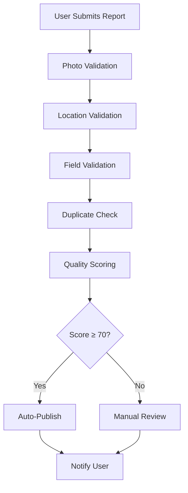
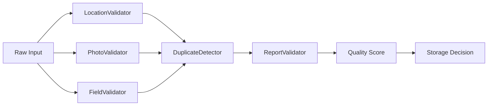

# RoadWatch System Architecture

## Overview

RoadWatch is a validation-driven civic issue tracking system that ensures accurate, non-duplicate, and location-verified reporting of road issues using smartphones. The system prioritizes data quality over data volume through strict validation at every submission stage.

## Core Architecture Principles

- **Validation-First**: Every submission passes through multiple validation layers
- **Quality Over Quantity**: Strict thresholds ensure only high-quality reports enter the system
- **Smart Duplicate Prevention**: Geospatial and temporal analysis prevents redundant reports
- **Mobile-Optimized**: Designed for smartphone GPS and camera capabilities

## System Components

### 1. Validation Layer
The heart of RoadWatch's quality assurance system:

```
┌─────────────────┐    ┌──────────────────┐    ┌─────────────────┐
│   User Input    │───▶│  Validation      │───▶│   Data Storage  │
│                 │    │  Pipeline        │    │                 │
└─────────────────┘    └──────────────────┘    └─────────────────┘
                              │
                              ▼
                       ┌──────────────────┐
                       │  Quality Score   │
                       │  (0-100)         │
                       └──────────────────┘
```

**Components:**
- **LocationValidator**: GPS accuracy and freshness validation
- **PhotoValidator**: File format, size, and metadata validation
- **DuplicateDetector**: Proximity-based duplicate prevention
- **ReportValidator**: Orchestrates all validation and scoring

### 2. Location Services
High-precision GPS handling with multiple accuracy strategies:

```
┌─────────────────┐    ┌──────────────────┐    ┌─────────────────┐
│  GPS Request    │───▶│  Enhanced        │───▶│  Best Reading   │
│                 │    │  Location        │    │  Selection      │
└─────────────────┘    └──────────────────┘    └─────────────────┘
                              │
                              ▼
                       ┌──────────────────┐
                       │  Accuracy        │
                       │  Validation      │
                       │  (≤200m)         │
                       └──────────────────┘
```

### 3. Duplicate Detection Engine
Intelligent duplicate prevention using geospatial analysis:

```
┌─────────────────┐    ┌──────────────────┐    ┌─────────────────┐
│  New Report     │───▶│  Proximity       │───▶│  Duplicate      │
│                 │    │  Search          │    │  Decision       │
└─────────────────┘    │  (50m radius)    │    └─────────────────┘
                       └──────────────────┘
                              │
                              ▼
                       ┌──────────────────┐
                       │  Category +      │
                       │  Time Match      │
                       │  (24hr window)   │
                       └──────────────────┘
```

## Data Flow Architecture

### Report Submission Flow


### Validation Pipeline


## Quality Assurance System

### Validation Scoring Matrix
| Component | Weight | Criteria |
|-----------|--------|----------|
| GPS Accuracy | 30% | ≤200m accuracy, <30s age |
| Photo Quality | 25% | Valid format, <5MB, metadata |
| Completeness | 25% | All required fields, description ≥10 chars |
| Duplicate Status | 20% | No duplicates within 50m/24hr |

### Quality Thresholds
- **Auto-Publish**: Score ≥ 70
- **Manual Review**: Score < 70
- **Rejection**: Critical validation failures

## Technology Stack

### Core Technologies
- **Frontend**: Next.js 14 with TypeScript
- **Validation**: Custom validation pipeline
- **Location**: Browser Geolocation API with enhanced accuracy
- **Storage**: Optimized for geospatial queries

### Key Libraries
- **Geospatial**: Haversine distance calculations
- **Image Processing**: File validation and compression
- **Type Safety**: Full TypeScript implementation

## Performance Considerations

### Geospatial Optimization
- Efficient proximity searches using spatial indexing
- Configurable search radii for different issue types
- Optimized distance calculations

### Mobile Optimization
- Progressive image compression
- Offline capability with sync
- Battery-efficient GPS usage

## Security & Rate Limiting

### Spam Prevention
- Per-user rate limiting
- Comprehensive validation logging
- Rejection mechanisms for failed validations

### Data Integrity
- Audit trails for all validation decisions
- Metadata preservation for debugging
- Comprehensive error logging