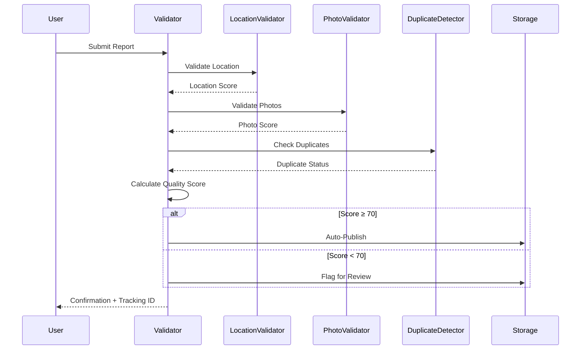
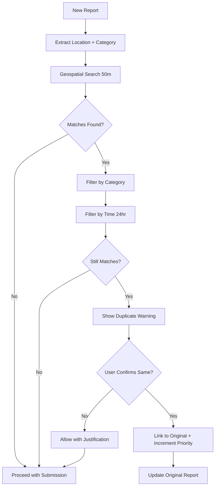
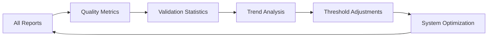

# RoadWatch End-to-End Workflows

## 1. Report Submission Workflow

### User Journey
```
📱 User opens app → 📍 GPS detection → 📷 Photo capture → ✍️ Form completion → ✅ Validation → 📊 Quality scoring → 🚀 Publication
```

### Detailed Steps

#### Step 1: Initial Setup
1. **App Launch**: User opens RoadWatch mobile application
2. **Permission Request**: System requests GPS and camera permissions
3. **Location Detection**: High-accuracy GPS positioning begins
4. **UI Preparation**: Form interface loads with validation feedback

#### Step 2: Photo Capture
1. **Camera Access**: User activates camera for issue documentation
2. **Image Capture**: Photo taken with automatic metadata extraction
3. **Format Validation**: System validates JPEG/PNG/WebP format
4. **Size Check**: Ensures image is under 5MB limit
5. **GPS Cross-Validation**: Compares image GPS metadata with device location

#### Step 3: Location Validation
1. **Accuracy Check**: GPS accuracy must be ≤200 meters
2. **Retry Logic**: Up to 3 attempts for poor GPS signals
3. **Timestamp Validation**: Location data must be <30 seconds old
4. **Coordinate Bounds**: Validates latitude/longitude ranges
5. **Enhanced Selection**: Chooses most accurate reading from multiple attempts

#### Step 4: Form Completion
1. **Category Selection**: User selects from predefined issue types
2. **Description Entry**: Minimum 10 characters required
3. **Real-time Validation**: Immediate feedback on field completion
4. **Mandatory Check**: All required fields validated before submission

#### Step 5: Duplicate Prevention
1. **Proximity Search**: System searches 50-meter radius for existing reports
2. **Category Matching**: Filters by same issue category
3. **Time Window**: Checks within 24-hour window
4. **User Confirmation**: If duplicate found, user confirms or overrides
5. **Link Creation**: Duplicate reports linked to original

#### Step 6: Quality Scoring
1. **Component Scoring**: Each validation component scored individually
2. **Weighted Calculation**: GPS (30%) + Photo (25%) + Completeness (25%) + Duplicate (20%)
3. **Threshold Check**: Score ≥70 for auto-publish, <70 for manual review
4. **Metadata Storage**: All validation details preserved

#### Step 7: Publication Decision
1. **Auto-Publish Path**: High-quality reports (≥70) published immediately
2. **Manual Review Path**: Lower-quality reports flagged for admin review
3. **User Notification**: Confirmation with tracking ID provided
4. **Status Assignment**: Initial status set to "pending"

## 2. Validation System Workflow

### Multi-Layer Validation Process



### Validation Components

#### LocationValidator Workflow
1. **Input**: GPS coordinates with accuracy and timestamp
2. **Accuracy Check**: Reject if accuracy > 200 meters
3. **Freshness Check**: Reject if timestamp > 30 seconds old
4. **Bounds Validation**: Ensure valid latitude/longitude ranges
5. **Output**: Pass/fail with accuracy score

#### PhotoValidator Workflow
1. **Input**: Image file from user upload
2. **Format Check**: Accept only JPEG, PNG, WebP
3. **Size Validation**: Reject files > 5MB
4. **Metadata Extraction**: Extract GPS coordinates if available
5. **Quality Assessment**: Score based on format and metadata
6. **Output**: Validation result with quality score

#### DuplicateDetector Workflow
1. **Input**: New report with location and category
2. **Geospatial Query**: Search existing reports within 50m radius
3. **Category Filter**: Match reports with same issue type
4. **Time Filter**: Consider only reports within 24 hours
5. **Distance Calculation**: Use Haversine formula for accuracy
6. **Output**: Duplicate status with potential matches

## 3. Duplicate Prevention Workflow

### Smart Duplicate Detection



### Duplicate Resolution Options

#### Option 1: Confirmed Duplicate
- **Action**: Link new report to existing report
- **Priority**: Increment priority score of original
- **Notification**: Notify original reporter of additional confirmation
- **Storage**: Store link relationship, don't create new report

#### Option 2: False Positive Override
- **Action**: Allow submission with justification note
- **Validation**: Require user explanation for override
- **Logging**: Record override decision for analysis
- **Storage**: Create new report with override metadata

#### Option 3: Enhanced Reporting
- **Action**: Add photos/details to existing report
- **Validation**: Merge additional evidence
- **Priority**: Boost existing report priority
- **Notification**: Update all linked reporters

## 4. Quality Assurance Workflow

### Continuous Quality Monitoring



### Quality Metrics Tracking
1. **Validation Success Rate**: Percentage of reports passing validation
2. **Duplicate Detection Rate**: Effectiveness of duplicate prevention
3. **GPS Accuracy Distribution**: Location quality trends
4. **Photo Quality Metrics**: Image validation success rates
5. **User Behavior Analysis**: Submission patterns and quality correlation

### Automated Quality Improvements
1. **Dynamic Thresholds**: Adjust validation criteria based on data quality trends
2. **Enhanced Algorithms**: Improve duplicate detection based on false positive analysis
3. **User Feedback Integration**: Incorporate user confirmations into algorithm training
4. **Performance Optimization**: Optimize validation speed while maintaining accuracy

## 5. Error Handling Workflows

### Validation Failure Responses

#### GPS Accuracy Issues
1. **Detection**: Accuracy > 200 meters
2. **Retry**: Attempt up to 3 times with 2-second intervals
3. **User Notification**: Display accuracy level and retry status
4. **Fallback**: Allow manual location adjustment if all retries fail
5. **Warning**: Clear indication of reduced location confidence

#### Photo Validation Failures
1. **Format Error**: Clear message about supported formats (JPEG, PNG, WebP)
2. **Size Error**: Specific guidance about 5MB limit and compression options
3. **Upload Error**: Retry mechanism with progress indication
4. **Metadata Warning**: Notification if GPS metadata unavailable

#### Network Connectivity Issues
1. **Offline Detection**: Monitor network status
2. **Local Storage**: Cache submissions for later sync
3. **Sync Notification**: Alert user when connectivity restored
4. **Conflict Resolution**: Handle conflicts during sync process

### Recovery Mechanisms
- **Graceful Degradation**: System continues with reduced functionality
- **Data Preservation**: No data loss during validation failures
- **User Guidance**: Clear instructions for resolving issues
- **Automatic Retry**: Smart retry logic for transient failures